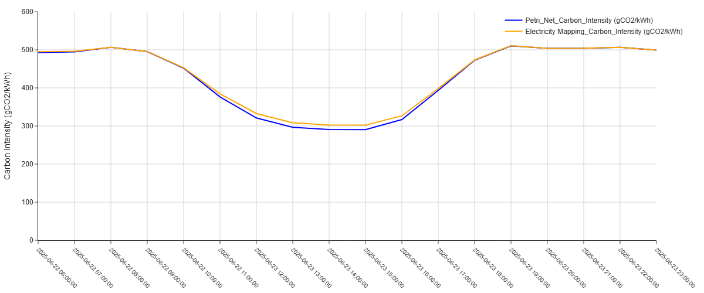
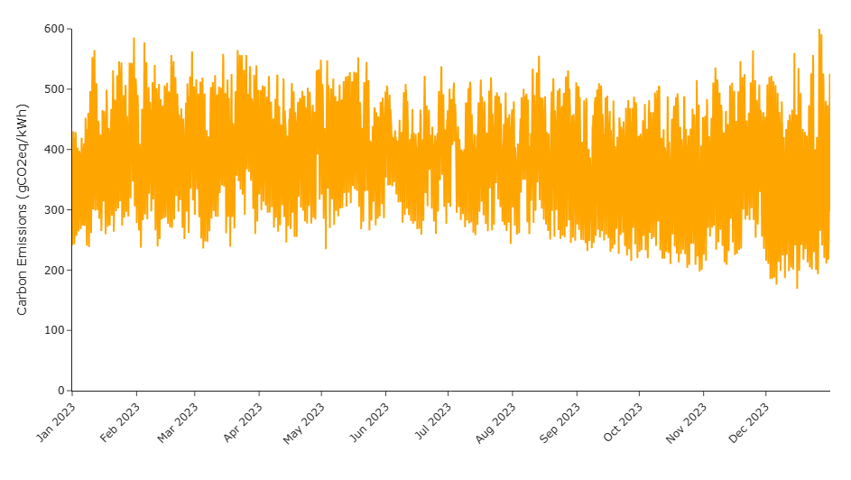

# Time-Varying Hydrogen Carbon Intensity Modeling Framework

A research-grade systems modeling framework for quantifying **hourly life-cycle carbon intensity of electrolytic hydrogen** under time-varying electricity grid conditions.

This work supports policy-aligned emissions accounting for clean hydrogen deployment, including qualification analysis under the **U.S. Inflation Reduction Act (IRA) Section 45V Clean Hydrogen Production Tax Credit**.

---

## National Relevance Summary

Accurate lifecycle emissions accounting is a critical unresolved challenge in U.S. clean hydrogen deployment.

Current industry practice frequently relies on annual-average electricity emissions factors, which fail to represent real-world grid operations and can materially misclassify hydrogen carbon intensity.

This repository documents independent research addressing this nationally important problem by enabling:

- time-resolved hydrogen lifecycle emissions accounting  
- avoidance of annual-average emissions bias  
- transparent evaluation of policy compliance under Section 45V  
- protection of federal clean energy investments  

The methodologies documented here support analysis relevant to programs administered by:

- U.S. Department of Energy  
- U.S. Department of the Treasury  
- National Renewable Energy Laboratory  
- Argonne National Laboratory  

---

## Purpose of This Repository

This repository documents original research and modeling tools developed to address a nationally important challenge:

**accurate measurement of hydrogen carbon intensity under real-world grid operations.**

Traditional static emissions accounting approaches fail to capture temporal variability in electricity systems, creating risk of emissions arbitrage, misallocation of federal incentives, and reduced environmental integrity.

This work provides a transparent and reproducible framework for **spatio-temporal hydrogen life-cycle assessment** using systems-based modeling methods.

---

## EB2 National Interest Waiver Alignment  
*(Matter of Dhanasar)*

This repository provides documentary evidence addressing all three criteria used by USCIS to evaluate National Interest Waiver petitions.

###  Prong 1 – National Importance  
Explains why accurate hydrogen emissions accounting is essential to U.S. energy policy and federal incentive programs.

[Prong 1 – National Importance](dhanasar/prong1_national_importance.md)

---

###  Prong 2 – Well Positioned to Advance the Endeavor  
Demonstrates the petitioner’s technical expertise, original research contributions, and capacity to continue advancing this work.

[Prong 2 – Well Positioned](dhanasar/prong2_well_positioned.md)

---

###  Prong 3 – Balance of Benefits  
Explains why waiving the job offer and labor certification requirement provides greater benefit to the United States.

[Prong 3 – Balance of Benefits](dhanasar/prong3_balance_of_benefits.md)

---

## Research Publications (PDF)

### 1. Enhancing Spatio-Temporal Resolution of Process-Based Life Cycle Analysis  
**Model-Based Systems Engineering & Hetero-functional Graph Theory**

[View PDF](papers/Enhancing%20Spatio-Temporal%20Resolution%20of%20Process-Based%20Life%20Cycle%20Analysis%20with%20Model-Based%20Systems%20Engineering%20%26%20Hetero-functional%20Graph%20Theory/paper.pdf)

---

### 2. Spatio-Temporal Life Cycle Analysis of Electrolytic H₂ Production in Australia  
**Time-Varying CO₂ Management Schemes**

[View PDF](papers/Spatio-Temporal%20Life%20Cycle%20Analysis%20of%20Electrolytic%20H2%20Production%20in%20Australia%20under%20Time-Varying%20CO2%20Management%20Schemes/paper.pdf)

---

## Policy Alignment

**U.S. Inflation Reduction Act – Section 45V**

- Time-matched electricity sourcing  
- Lifecycle emissions thresholds  
- Prevention of emissions arbitrage  

[Section 45V Policy Alignment](policy/45V_alignment.md)

---

## Key Technical Contributions

- Hourly hydrogen carbon intensity modeling (8760-hour resolution)  
- Integration of electricity grid emissions with electrolyzer operation  
- Elimination of annual-average emissions bias  
- Spatio-temporal system boundary representation  
- Policy-relevant lifecycle accounting methodology  
- Systems modeling using MBSE and HFGT frameworks  

---

## Systems Architecture Overview

This repository implements a **systems-based life-cycle modeling architecture** for quantifying the carbon intensity of electrolytic hydrogen production under time-varying electricity grid conditions.

The framework integrates:

- physical energy system representation  
- operational electricity dispatch behavior  
- life-cycle emissions accounting  
- policy-aligned evaluation under Section 45V  

into a single coherent analytical structure.

The architecture is derived from the modeling methodologies presented in the accompanying peer-reviewed publications and is implemented using **Model-Based Systems Engineering (MBSE)** and **Hetero-functional Graph Theory (HFGT)**.

---

## High-Level System Representation

The hydrogen production system is modeled as an interconnected **engineering system of systems** consisting of:

- electricity generation assets  
- transmission and conversion infrastructure  
- energy storage components  
- electrolyzer systems  
- material and energy flows  

The full hydrogen life-cycle boundary includes:

- upstream electricity generation  
- grid transmission and transformation  
- electrolyzer operation  
- hydrogen and oxygen production  
- associated energy losses and emissions  

This ensures emissions are attributed based on **actual operational pathways**, not static averages.

---

## Figure 1. HFGT Formal Meta-Architecture


The formal meta-architecture defines the universal system elements used throughout the model:

- **Operands (L)**  
  Represent matter, energy, and information flows such as electricity, hydrogen, water, and emissions.

- **Resources (R)**  
  Represent physical assets capable of performing transformations or transport, including generators, transmission lines, substations, storage systems, and electrolyzers.

- **Buffers (B)**  
  Represent spatial or temporal holding locations such as grid nodes, storage units, and system boundaries.

- **Processes / Transitions (E)**  
  Represent energy conversion and transport operations such as generation, transformation, transmission, and electrolysis.

This formal structure enables scalable system representation while preserving physical and operational consistency.

---

## Figure 2. Hydrogen Life-Cycle System Architecture


The hydrogen life-cycle architecture explicitly models:

- multiple electricity generation technologies  
  - coal  
  - natural gas  
  - oil  
  - biomass  
  - solar  
  - wind  
  - hydro  
  - geothermal  

- grid infrastructure components  
  - transmission lines  
  - substations  
  - storage systems  

- downstream hydrogen production via PEM electrolysis  

Energy flows are tracked continuously across the grid until consumption by the electrolyzer, allowing emissions attribution based on **marginal grid behavior at each hour**.

This structure enables:

- time-matched electricity sourcing  
- spatial differentiation across grid regions  
- accurate propagation of emissions through the energy system  

---

## Mathematical Representation via Incidence Matrices

## Figure 3. HFGT Incidence Matrix Representation


The system architecture is mathematically represented using **incidence matrices**, which encode the relationships between:

- operands  
- processes  
- buffers  
- resources  

This formulation enables:

- linear-algebra-based life-cycle accounting  
- explicit conservation of energy and mass  
- transparent emissions propagation  
- reproducible computational implementation  

The matrix structure allows the hydrogen life-cycle model to scale from conceptual system diagrams to quantitative simulation without structural modification.

---

## Time-Varying Simulation Framework

The architecture supports **hourly time-step simulation (8760 hours per year)**, where each timestep includes:

- grid generation mix  
- marginal emissions behavior  
- electricity routing through infrastructure  
- electrolyzer operating state  
- resulting hydrogen production and emissions  

This approach eliminates the distortions introduced by annual-average emissions factors and captures real operational dynamics of power systems.

---

## Figure 4. Hourly Carbon Intensity Validation



Figure 4 compares hourly carbon intensity values computed using the proposed HFGT-based life-cycle framework against independently reported Electricity Maps data.

The close agreement between the two time series demonstrates:

- correctness of the system architecture  
- validity of emissions propagation logic  
- robustness of the time-resolved modeling approach  

Minor deviations arise from rounding effects and data resolution differences.

---

### Figure 5 – Full-Year Hourly Carbon Intensity Variability (8760 Hours)



This figure presents the hourly life-cycle carbon intensity of electricity generation across an entire calendar year. The magnitude of intra-day and seasonal variability demonstrates the limitations of annual-average emissions factors and highlights the necessity of time-resolved accounting for clean hydrogen qualification under Section 45V of the Inflation Reduction Act.

---

## Policy-Aligned Architecture

The modeling framework is explicitly designed to support regulatory evaluation under:

- **U.S. Inflation Reduction Act – Section 45V**
- time-matching requirements  
- lifecycle emissions thresholds  
- avoidance of emissions arbitrage  

By representing hydrogen production as a dynamic system rather than a static average, the architecture enables credible qualification analysis aligned with emerging federal guidance.

---

## Summary

The systems architecture presented in this repository:

- integrates engineering system structure with life-cycle assessment  
- enables spatio-temporal emissions accounting  
- supports hourly operational modeling  
- provides mathematically transparent computation  
- aligns directly with U.S. clean hydrogen policy requirements  

This unified architecture forms the foundation for accurate, reproducible, and policy-relevant hydrogen carbon intensity analysis.

---

## Repository Structure

```
time-varying-hydrogen-carbon-intensity/
├── README.md
├── papers/
│   ├── Enhancing Spatio-Temporal Resolution of Process-Based Life Cycle Analysis/
│   │   └── paper.pdf
│   └── Spatio-Temporal Life Cycle Analysis of Electrolytic H2 Production in Australia/
│       └── paper.pdf
├── dhanasar/
│   ├── prong1_national_importance.md
│   ├── prong2_well_positioned.md
│   └── prong3_balance_of_benefits.md
├── policy/
│   └── 45V_alignment.md
├── modeling/
├── data/
├── scripts/
└── notebooks/
```

---

## Author

**Niraj Gohil**  
Research Scientist | Systems Engineering and Energy Systems Modeling  

Former Research Scientist, Stevens Institute of Technology  

Collaborations include:

- CSIRO – Australia’s National Science Agency  
- Argonne National Laboratory – U.S. Department of Energy  

Research focus:

- Spatio-temporal life cycle assessment (LCA)  
- Time-varying hydrogen carbon intensity modeling  
- Grid-dispatch-aware emissions accounting  
- Policy-aligned analysis for U.S. Section 45V hydrogen tax credits


