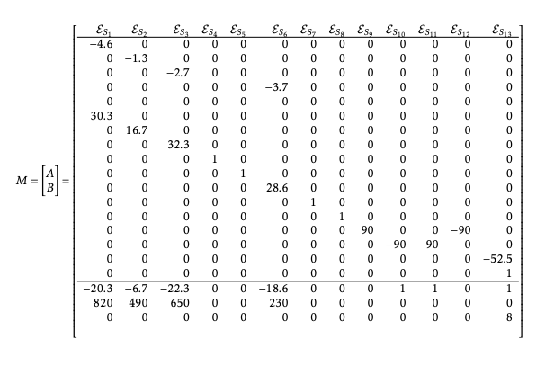

# Time-Varying Hydrogen Carbon Intensity Modeling Framework

A research-grade systems modeling framework for quantifying **hourly life-cycle carbon intensity of electrolytic hydrogen** under time-varying electricity grid conditions.

This work supports policy-aligned emissions accounting for clean hydrogen deployment, including qualification analysis under the **U.S. Inflation Reduction Act (IRA) Section 45V Clean Hydrogen Production Tax Credit**.

---

## National Relevance Summary

Accurate lifecycle emissions accounting is a critical unresolved challenge in U.S. clean hydrogen deployment.

Current industry practice frequently relies on annual-average electricity emissions factors, which fail to represent real-world grid operations and can materially misclassify hydrogen carbon intensity.

This repository documents independent research addressing this nationally important problem by enabling:

- time-resolved hydrogen lifecycle emissions accounting  
- avoidance of annual-average emissions bias  
- transparent evaluation of policy compliance under Section 45V  
- protection of federal clean energy investments  

The methodologies documented here support analysis relevant to programs administered by:

- U.S. Department of Energy  
- U.S. Department of the Treasury  
- National Renewable Energy Laboratory  
- Argonne National Laboratory  

---

## Purpose of This Repository

This repository documents original research and modeling tools developed to address a nationally important challenge:

**accurate measurement of hydrogen carbon intensity under real-world grid operations.**

Traditional static emissions accounting approaches fail to capture temporal variability in electricity systems, creating risk of emissions arbitrage, misallocation of federal incentives, and reduced environmental integrity.

This work provides a transparent and reproducible framework for **spatio-temporal hydrogen life-cycle assessment** using systems-based modeling methods.

---

## EB2 National Interest Waiver Alignment  
*(Matter of Dhanasar)*

This repository provides documentary evidence addressing all three criteria used by USCIS to evaluate National Interest Waiver petitions.

###  Prong 1 – National Importance  
Explains why accurate hydrogen emissions accounting is essential to U.S. energy policy and federal incentive programs.

[Prong 1 – National Importance](dhanasar/prong1_national_importance.md)

---

###  Prong 2 – Well Positioned to Advance the Endeavor  
Demonstrates the petitioner’s technical expertise, original research contributions, and capacity to continue advancing this work.

[Prong 2 – Well Positioned](dhanasar/prong2_well_positioned.md)

---

###  Prong 3 – Balance of Benefits  
Explains why waiving the job offer and labor certification requirement provides greater benefit to the United States.

[Prong 3 – Balance of Benefits](dhanasar/prong3_balance_of_benefits.md)

---

## Research Publications (PDF)

### 1. Enhancing Spatio-Temporal Resolution of Process-Based Life Cycle Analysis  
**Model-Based Systems Engineering & Hetero-functional Graph Theory**

[View PDF](papers/Enhancing%20Spatio-Temporal%20Resolution%20of%20Process-Based%20Life%20Cycle%20Analysis%20with%20Model-Based%20Systems%20Engineering%20%26%20Hetero-functional%20Graph%20Theory/paper.pdf)

---

### 2. Spatio-Temporal Life Cycle Analysis of Electrolytic H₂ Production in Australia  
**Time-Varying CO₂ Management Schemes**

[View PDF](papers/Spatio-Temporal%20Life%20Cycle%20Analysis%20of%20Electrolytic%20H2%20Production%20in%20Australia%20under%20Time-Varying%20CO2%20Management%20Schemes/paper.pdf)

---

## Policy Alignment

**U.S. Inflation Reduction Act – Section 45V**

- Time-matched electricity sourcing  
- Lifecycle emissions thresholds  
- Prevention of emissions arbitrage  

[Section 45V Policy Alignment](policy/45V_alignment.md)

---

## Key Technical Contributions

- Hourly hydrogen carbon intensity modeling (8760-hour resolution)  
- Integration of electricity grid emissions with electrolyzer operation  
- Elimination of annual-average emissions bias  
- Spatio-temporal system boundary representation  
- Policy-relevant lifecycle accounting methodology  
- Systems modeling using MBSE and HFGT frameworks  

---

## System Architecture Overview

The figure below presents the formal meta-architecture used in this research
to enable spatio-temporal life cycle assessment of electrolytic hydrogen systems.

The framework integrates:

- Model-Based Systems Engineering (MBSE)
- Hetero-functional Graph Theory (HFGT)
- Process-based Life Cycle Assessment (LCA)
- Time-varying electricity grid emissions modeling


## System Architecture Overview

**Hydrogen Life Cycle System Architecture modeled using MBSE and HFGT**


### Formal Systems Representation

The hydrogen production system is formally represented using Hetero-functional Graph Theory (HFGT).

The incidence matrix defines:

- process–operand relationships  
- resource–process coupling  
- transformation and transportation constraints  
- complete system conservation structure  

This formulation enables mathematically rigorous life-cycle emissions computation under time-varying grid conditions.



---

## Repository Structure

```
time-varying-hydrogen-carbon-intensity/
├── README.md
├── papers/
│   ├── Enhancing Spatio-Temporal Resolution of Process-Based Life Cycle Analysis/
│   │   └── paper.pdf
│   └── Spatio-Temporal Life Cycle Analysis of Electrolytic H2 Production in Australia/
│       └── paper.pdf
├── dhanasar/
│   ├── prong1_national_importance.md
│   ├── prong2_well_positioned.md
│   └── prong3_balance_of_benefits.md
├── policy/
│   └── 45V_alignment.md
├── modeling/
├── data/
├── scripts/
└── notebooks/
```

---

## Author

**Niraj Gohil**  
Research Scientist | Systems Engineering and Energy Systems Modeling  

Former Research Scientist, Stevens Institute of Technology  

Collaborations include:

- CSIRO – Australia’s National Science Agency  
- Argonne National Laboratory – U.S. Department of Energy  

Research focus:

- Spatio-temporal life cycle assessment (LCA)  
- Time-varying hydrogen carbon intensity modeling  
- Grid-dispatch-aware emissions accounting  
- Policy-aligned analysis for U.S. Section 45V hydrogen tax credits


